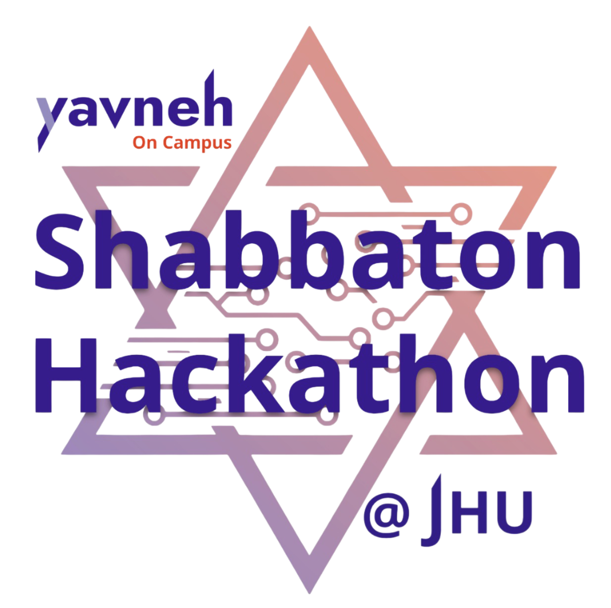

# About  
The Shabbaton Hackathon will be a Shabbaton experience followed by a 20-hour hackathon on the weekend of November 7th to 9th, hosted at Johns Hopkins University Hillel.   

At the Shabbaton, students will have the full Shabbat experience at Johns Hopkins Hillel, where meals, services, and learning opportunities will be provided. Participants will be hosted overnight by Johns Hopkins students, and the Smokler Center of Jewish Life will be available throughout the hackathon.

For the Hackathon, teams of up to 4 will compete against each other to design a contribution to [Sefaria](https://www.sefaria.org/texts) around a project that will be announced Saturday night. During the Hackathon, students will have the opportunity to speak with Hopkins professors and other tech professionals. By 4:30 PM, all submissions will be collected, and the event will conclude at 6:30 PM.

### We're looking forward to seeing you there!